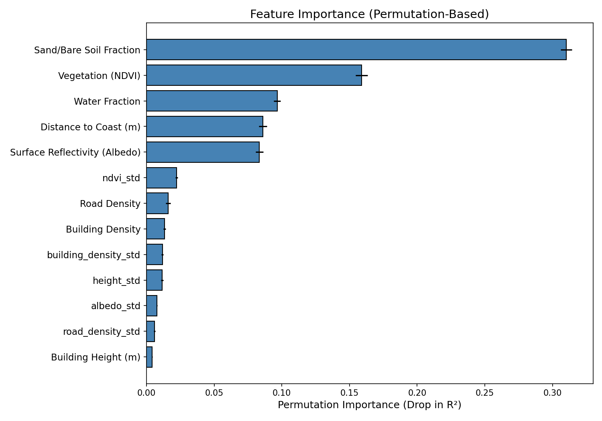
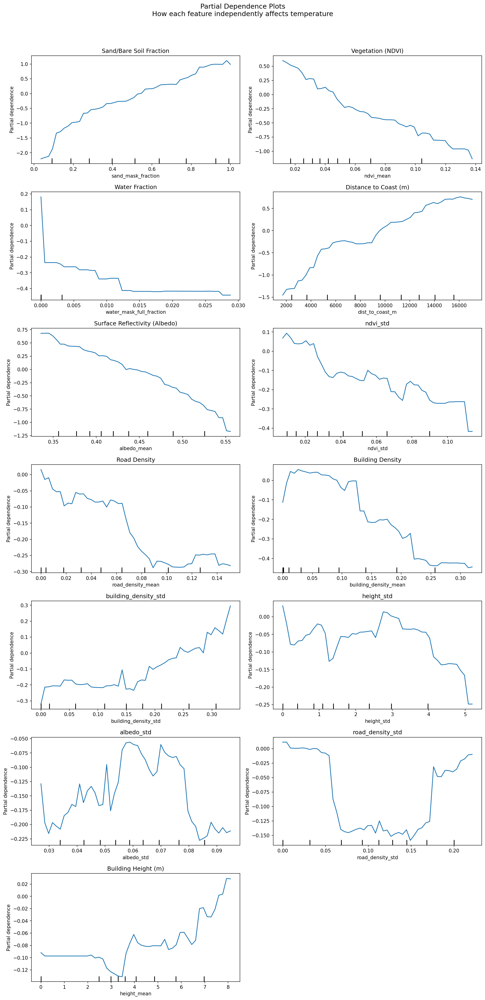
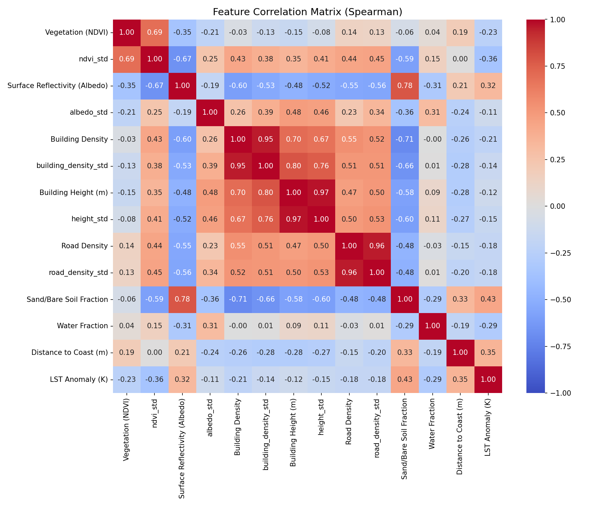
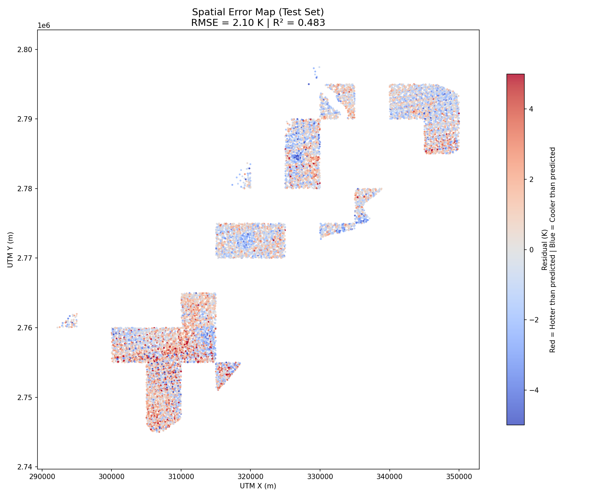

# Phase 2B: Model Interpretation Report

**Model**: HistGradientBoostingRegressor  
**Target**: LST Anomaly (Pixel Temperature − Scene Mean)  
**Test R²**: 0.534 | **Test RMSE**: 2.40 K  
**Features**: 8 | **Training Samples**: 29,719 | **Test Samples**: 12,802  
**Spatial Split**: 5,000m block-based (prevents data leakage from spatial autocorrelation)

---

## 1. Feature Importance (Permutation-Based)

Permutation importance measures how much the model's R² drops when each feature is randomly shuffled. Higher values indicate stronger predictive power.

| Rank | Feature                       | Importance (ΔR²) | Category          |
| ---- | ----------------------------- | ---------------- | ----------------- |
| 1    | Sand/Bare Soil Fraction       | 0.384            | Land Cover        |
| 2    | Water Fraction                | 0.294            | Land Cover        |
| 3    | Vegetation (NDVI)             | 0.136            | Urban Design      |
| 4    | Distance to Coast             | 0.124            | Geography         |
| 5    | Surface Reflectivity (Albedo) | 0.114            | Material Property |
| 6    | Road Density                  | 0.031            | Urban Form        |
| 7    | Building Density              | 0.011            | Urban Form        |
| 8    | Building Height               | 0.009            | Urban Form        |

### Key Takeaways

- **Land Cover dominates** (~68% of total importance). At 750m resolution, whether a pixel is desert, water, or vegetated is the primary temperature driver.
- **Distance to Coast** is the 4th most important feature. This was newly added and pushed R² from 0.49 to 0.53 — the single biggest improvement. The sea breeze effect in Dubai is confirmed as a major thermal modifier.
- **Urban Form features** (Height, Density, Roads) have small but measurable effects at 750m. Their contribution is expected to increase significantly at 30m resolution (Phase 2C), where individual buildings and streets are resolved.

---

## 2. Partial Dependence Plots (PDPs)

PDPs show how each feature **independently** affects the predicted temperature, while holding all other features constant. These are the physical relationships learned by the model.

### Physical Interpretations

**Sand/Bare Soil Fraction** (Importance: 0.384)

- Clear positive trend: more sand → hotter surface.
- Dubai's exposed sand absorbs and re-emits thermal energy efficiently.
- Even small reductions in sand coverage (e.g., ground cover, paving) measurably reduce temperature.

**Water Fraction** (Importance: 0.294)

- Strong negative trend: more water → cooler surface.
- Water has high thermal inertia and evaporative cooling.
- Even partial water presence (canals, fountains) provides localised cooling.

**Vegetation (NDVI)** (Importance: 0.136)

- Negative trend: more greenery → cooler surface.
- Cooling occurs through evapotranspiration and shading.
- Look for a plateau at high NDVI: there may be diminishing returns beyond a certain vegetation threshold.

**Distance to Coast** (Importance: 0.124)

- Positive trend: further from the Gulf → hotter.
- The sea breeze effect provides significant cooling to coastal areas.
- The effect appears strongest in the first 5–8 km, then levels off.

**Surface Reflectivity (Albedo)** (Importance: 0.114)

- Negative trend: higher albedo → cooler.
- Lighter-coloured surfaces (white roofs, concrete) reflect more sunlight.
- This is a directly actionable urban design parameter (cool roofs, reflective pavements).

**Road Density, Building Density, Building Height** (Importance: 0.009–0.031)

- Small effects at 750m resolution.
- Road density shows a slight warming trend (dark asphalt absorbs heat).
- Building density and height show noisy curves — expected at 750m where individual buildings are averaged out.
- These features will become more influential at 30m resolution.

---

## 3. Feature Correlation Matrix (Spearman)

### Key Correlations to Note

- **Sand vs Water**: Expected strong negative correlation (mutually exclusive land covers).
- **NDVI vs Sand**: Negative (where there's vegetation, there's less bare sand).
- **Height vs Density**: If correlation < 0.7, they provide distinct information (High Density + Low Height = Villas; High Density + High Height = Skyscrapers).
- **Distance to Coast vs Water Fraction**: Check whether coast distance adds information beyond water fraction alone (if correlation < 0.7, it does).

---

## 4. Spatial Error Map

The residual map (Actual − Predicted) reveals where the model performs well and where it struggles.

- **Red clusters (Model underestimates heat)**: These areas are hotter than the model predicts. Possible causes: industrial waste heat, construction activity, localised heat sources not captured by our features.
- **Blue clusters (Model overestimates heat)**: These areas are cooler than predicted. Possible causes: unmapped green spaces, elevation effects, localised sea breeze channels.
- **White/neutral areas**: The model is accurate here.

### Spatial Patterns

- Check if errors cluster near the **coast** (sea breeze channeling through creek/marina corridors).
- Check if errors cluster in **industrial zones** (Jebel Ali, Al Quoz) where factory waste heat is not captured.
- Check if errors are larger in **developing areas** where land cover is changing rapidly.

---

## 5. Model Evolution Summary

| Stage                   | Features                                          | R²       | RMSE (K) | Key Change                                  |
| ----------------------- | ------------------------------------------------- | -------- | -------- | ------------------------------------------- |
| Baseline (7 features)   | NDVI, Albedo, Density, Roads, Sand, Water, Height | 0.49     | 2.51     | Initial model                               |
| + Distance to Coast     | All above + Coast Distance                        | **0.53** | **2.40** | +4% R² — sea breeze effect                  |
| + Hyperparameter Tuning | Same 8 features, optimised params                 | 0.53     | 2.42     | No improvement (defaults were near-optimal) |

### Conclusions

1. **The model captures 53% of the variance** in LST anomaly using 8 physically meaningful features.
2. **Land cover and geography** are the primary drivers at 750m resolution.
3. **Urban form** (Height, Density) has small but real effects that will become more prominent after downscaling to 30m (Phase 2C).
4. **Distance to coast** is a critical feature for Dubai — the sea breeze is a dominant cooling mechanism.
5. **The model is ready for downscaling** (Phase 2C) and subsequent simulation (Phase 3).
